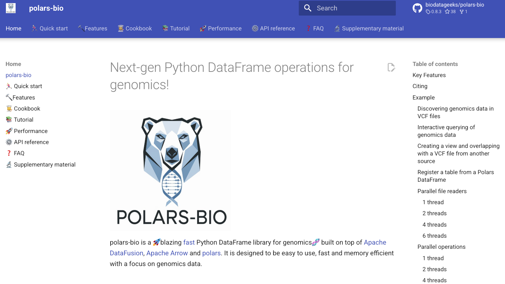

## [polars-bio](https://biodatageeks.org/polars-bio/)

## [SeQuiLa](https://biodatageeks.org/sequila/)
SeQuiLa project was started at Institute of Computer Science at Warsaw University of Technology in late 2017. The main goal of the project was to extend [Apache Spark](https://spark.apache.org/) with fast and scalable implementations of common bioinformatics operations need for processing large next-generation sequencing datasets such as [interval joins](https://doi.org/10.1093/bioinformatics/bty940), [depth of coverage](https://doi.org/10.1093/gigascience/giz094) or [pileup](https://doi.org/10.1093/bioinformatics/btac804).
If you are new to Apache Spark and distributed processing we highly recommend you to get started with great Apache Spark documentation.
Beware that SeQuiLa is just an extension to Apache Spark - the combination of two gives you almost unlimited analytical power to crunch NGS data at any scale!

